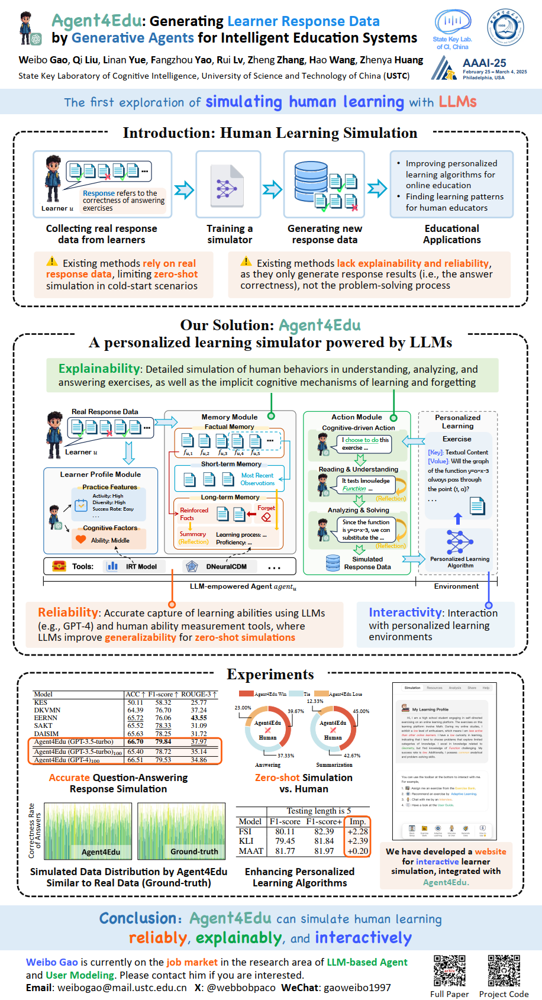
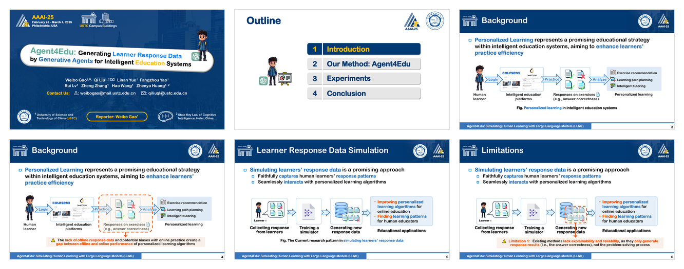

# Agent4Edu

Official implementation for **Agent4Edu: Generating Learner Response Data by Generative Agents for Intelligent Education Systems**.

Agent4Edu builds LLM-powered learner agents to simulate learner response data and problem-solving behaviors for intelligent education systems. The repository follows the paper pipeline: learner profile construction, memory construction, action simulation, and interaction with personalized learning tasks.

## Poster and Slides

<p align="center">
  
</p>

<p align="center">
  <a href="Agent4Edu-Slide_web.pdf">
    
  </a>
</p>

<p align="center">
  <a href="Agent4Edu-Slide_web.pdf">View full slides</a>
</p>

## Repository Structure

```text
Agent4Edu
├── Code/
│   ├── main.py                         # run Agent4Edu simulation
│   ├── profile.py                      # learner profile module
│   ├── memory.py                       # factual / short-term / long-term memory
│   ├── action.py                       # learner action simulation
│   ├── llm_client.py                   # LLM API wrapper
│   ├── prepare/
│   │   ├── build_profile.py            # build profile.json from logs and IRT ability
│   │   └── normalize_kcg.py            # convert graph files to Agent4Edu kcg.json
│   └── tools/
│       ├── irt/                        # IRT tool for learner ability estimation
│       ├── dneuralcdm/                 # DNeuralCDM tool for knowledge proficiency
│       ├── rcd_graph/                  # RCD-style knowledge relation graph builder
│       ├── relation_graph.py           # runtime KCG loader
│       └── knowledge_proficiency.py    # runtime proficiency loader
└── data/demo/                          # demo data
```

## Paper-to-Code Mapping

| Paper component | Code location | Main artifact |
|---|---|---|
| IRT-based learner ability | `Code/tools/irt/` | `epoch_*_stu_ability.npy` |
| Learner profile | `Code/prepare/build_profile.py`, `Code/profile.py` | `profile.json` |
| DNeuralCDM-based knowledge proficiency | `Code/tools/dneuralcdm/` | `stu_know_proficiency.json` |
| RCD-style knowledge concept graph | `Code/tools/rcd_graph/build_kcg.py`, `Code/tools/relation_graph.py` | `kcg.json` |
| Memory module | `Code/memory.py` | factual, short-term, and long-term memory |
| Action module | `Code/action.py` | simulated choosing, understanding, solving, and response prediction |
| Simulation runtime | `Code/main.py` | `actions.json`, memory files, and summaries |

The IRT and DNeuralCDM model architectures are kept consistent with the supplied implementation. Agent4Edu uses the RCD graph construction utility for knowledge relations; it does not train or call the RCD cognitive diagnosis model.

## Installation

```bash
conda create -n agent4edu python=3.10 -y
conda activate agent4edu
pip install -r requirements.txt
```

For OpenAI or OpenAI-compatible APIs:

```bash
export AGENT4EDU_LLM_PROVIDER=openai
export OPENAI_API_KEY=YOUR_API_KEY
export AGENT4EDU_OPENAI_MODEL=gpt-3.5-turbo-1106
```

Optional for OpenAI-compatible gateways:

```bash
export OPENAI_BASE_URL=https://your-api-endpoint/v1
```

## Demo Run

The demo data already contains processed profile and graph files. Run:

```bash
python Code/main.py --data-dir data/demo --students 0 --max-steps 2 --llm-provider mock
```

Outputs are saved to:

```text
Code/simulation/student_<id>/
├── actions.json
├── memory_factual.json
├── memory_short.json
├── memory_long.json
└── summary.json
```

Use real LLM simulation by replacing `--llm-provider mock` with `--llm-provider openai` after setting the API environment variables.

## Data Format

Agent4Edu expects `stu_logs.json` to be a list of learners:

```json
[
  {
    "user_id": 5,
    "logs": [
      {
        "exer_id": 464,
        "knowledge_code": 226,
        "know_name": "Function",
        "score": 1,
        "exer_content": "...",
        "exer_option": "...",
        "exer_answer": "...",
        "exer_analysis": "..."
      }
    ]
  }
]
```

The runtime data directory should contain:

```text
stu_logs.json              # learner response logs
profile.json               # learner profile generated from logs and IRT ability
kcg.json                   # knowledge concept graph
know_name_list.json         # concept name to concept id
know_course_list.json       # concept name to course/subject
stu_know_proficiency.json   # optional DNeuralCDM proficiency output
```

## Full Pipeline

### 1. Estimate Learner Ability with IRT

Prepare IRT data:

```bash
python Code/tools/irt/split_data.py \
  --logs data/iflytek_sample/stu_logs.json \
  --output-dir Code/tools/irt/runs/iflytek/data \
  --config Code/tools/irt/runs/iflytek/config.txt
```

Train IRT:

```bash
python Code/tools/irt/train.py \
  --data-dir Code/tools/irt/runs/iflytek/data \
  --config Code/tools/irt/runs/iflytek/config.txt \
  --output-dir Code/tools/irt/runs/iflytek \
  --epochs 10
```

Main output:

```text
Code/tools/irt/runs/iflytek/ability/epoch_10_stu_ability.npy
```

### 2. Build Learner Profile

```bash
python Code/prepare/build_profile.py \
  --logs data/iflytek_sample/stu_logs.json \
  --config Code/tools/irt/runs/iflytek/config.txt \
  --irt-ability Code/tools/irt/runs/iflytek/ability/epoch_10_stu_ability.npy \
  --output data/iflytek_sample/profile.json
```

`profile.json` contains:

```text
student_id    activity    diversity    most_practiced_concept    success_rate    IRT_ability
```

Profile features follow the paper design:

```text
activity      = number_of_logs / number_of_exercises
diversity     = number_of_distinct_concepts / number_of_concepts
success_rate  = number_of_correct_answers / number_of_logs
ability       = IRT-estimated learner ability
preference    = most frequently practiced concept
```

### 3. Build Knowledge Concept Graph

Agent4Edu uses the concept-map construction utility from RCD under `data/ASSIST/graph`. The refactored tool is provided in `Code/tools/rcd_graph/build_kcg.py`.

Build KCG from `stu_logs.json`:

```bash
python Code/tools/rcd_graph/build_kcg.py \
  --logs data/iflytek_sample/stu_logs.json \
  --output-dir data/iflytek_sample/graph \
  --agent-kcg data/iflytek_sample/kcg.json \
  --relation-scope all
```

Generated files:

```text
knowledgeGraph.txt      # selected concept-map edges
K_Directed.txt          # directed concept relations
K_Undirected.txt        # reciprocal concept relations
kcg.json                # Agent4Edu runtime graph
graph_stats.json        # graph statistics
```

`--relation-scope all` uses all selected concept-map edges for memory reinforcement. Use `undirected` for reciprocal relations only, or `directed` for one-way relations only.

If an RCD graph file already exists, convert it to Agent4Edu format:

```bash
python Code/prepare/normalize_kcg.py \
  --input path/to/K_Undirected.txt \
  --output data/iflytek_sample/kcg.json
```

### 4. Export Knowledge Proficiency with DNeuralCDM

Train DNeuralCDM:

```bash
python Code/tools/dneuralcdm/train.py \
  --logs data/iflytek_sample/stu_logs.json \
  --output-dir Code/tools/dneuralcdm/runs/iflytek \
  --epochs 5
```

Export dynamic knowledge proficiency:

```bash
python Code/tools/dneuralcdm/export_proficiency.py \
  --logs data/iflytek_sample/stu_logs.json \
  --checkpoint Code/tools/dneuralcdm/runs/iflytek/best_model.pt \
  --output data/iflytek_sample/stu_know_proficiency.json
```

The simulation runtime reads this exported file directly for efficiency.

### 5. Run Agent4Edu Simulation

Run selected learners by row index:

```bash
python Code/main.py \
  --data-dir data/iflytek_sample \
  --students 0,1,2 \
  --max-steps 0 \
  --llm-provider openai
```

Run selected learners by actual `user_id`:

```bash
python Code/main.py \
  --data-dir data/iflytek_sample \
  --students 5,8,11 \
  --student-ids \
  --llm-provider openai
```

`--max-steps 0` means using all logs of each selected learner.

## Memory Implementation

The memory module contains:

- factual memory: original response records;
- short-term memory: the most recent response records;
- long-term memory: reinforced facts, learning status summaries, and DNeuralCDM proficiency context.

KCG relations are used to reinforce related factual memories. The learning status summary is stored over time for inspection, while only the latest summary is used in the action prompt. Forgetting follows the paper formulation and resets the corresponding factual-memory counter after a long-term fact is forgotten.

## Runtime Output

For each exercise, the agent completes four tasks:

```text
Task1: decide whether to attempt the exercise
Task2: identify the tested knowledge concept
Task3: generate a problem-solving process and final answer
Task4: predict whether the learner can answer correctly
```

The result directory stores action outputs, parsed task results, memory states, reflections, and task-level summary scores.

## Citation

If you use this repository, please cite Agent4Edu:

```bibtex
@inproceedings{gao2025agent4edu,
  title={Agent4edu: Generating learner response data by generative agents for intelligent education systems},
  author={Gao, Weibo and Liu, Qi and Yue, Linan and Yao, Fangzhou and Lv, Rui and Zhang, Zheng and Wang, Hao and Huang, Zhenya},
  booktitle={Proceedings of the AAAI Conference on Artificial Intelligence},
  volume={39},
  number={22},
  pages={23923--23932},
  year={2025}
}
```

Agent4Edu uses the RCD concept-map construction utility for KCG construction. Please also cite RCD when using this part:

```bibtex
@inproceedings{gao2021rcd,
  title={RCD: Relation Map Driven Cognitive Diagnosis for Intelligent Education Systems},
  author={Gao, Weibo and Liu, Qi and Huang, Zhenya and Yin, Yu and Bi, Haoyang and Wang, Mu-Chun and Ma, Jianhui and Wang, Shijin and Su, Yu},
  booktitle={Proceedings of the 44th International ACM SIGIR Conference on Research and Development in Information Retrieval},
  pages={501--510},
  year={2021}
}
```

RCD repository: https://github.com/bigdata-ustc/RCD
